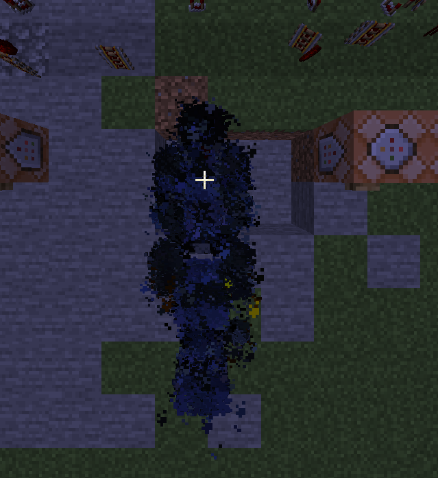

# 3D Model To Minecraft Particles

A Project that turns ply 3d models into 3d models out of particles in minecraft



# Warnings

**Very** Laggy

Made for Minecraft 1.21 should work for some older versions but idk

Can **seriously** hurt mspt and tps

# How to use:

In the directory type `pip install -r requirements.txt`

Open 3DtoParticle.py and edit the:

```python
vertices, tex_coords = parse_ply_ascii('put in the 3d model file here')
texture_image = 'the texture of the 3d model'

# The size of the model compared to the minecarft world
# Requires testing to get used to how it affects the model
scale_factor =  2
```

Run in terminal `py 3DtoParticle.py` 

Next in terminal run `py main.py`

Set the mode r or i 

R = Repeating

I = Impulse

Repeating means when activated it will repeat every tick
Impulse makes it happen once

The commands are split into 32,000 chunks of charcters due to command blocks charter limit, you can disable this in settings.


Next run `py copy.py`
It will automaticly copy every command 1 by one into your clipboard, press p to go to the next command

Paste each command into a command block and activate it

Spawn a armor stand and add a tag to it (Can be anything like player, mobs, ect (Armor stand is a example but reccomened for most effects that are static)) that is the same as what you entered in on main.py

Hook up all of the command blocks together and power them


